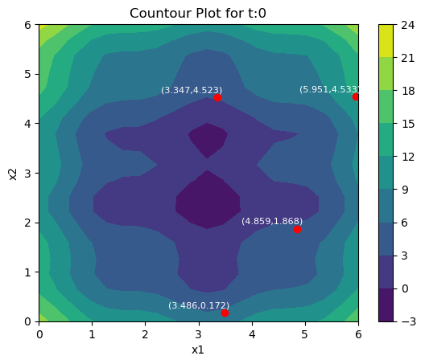
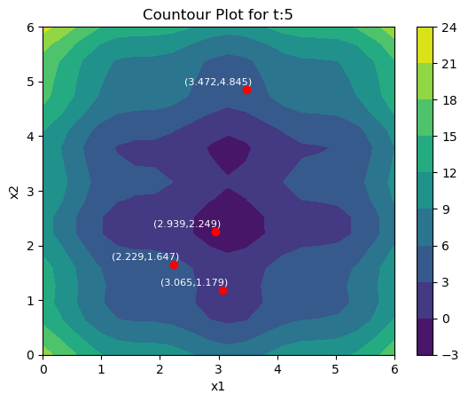
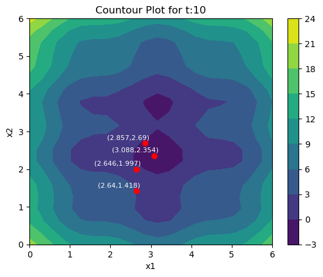
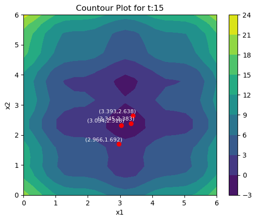
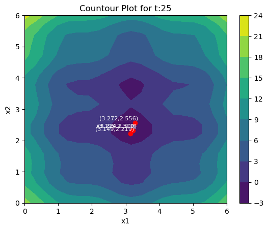

# Local Search


```python


```

## Without Archive


```python
# Check if solution meets the constraints and is feasable. Return -1 for infeasable solutions
def isfeasable(s):
    #Constraint calculation
    total = s[0] + 2*s[1] + 3*s[2] + 2*s[3] + 3*s[4] + 4*s[5] + s[6] + 5*s[7] + 3*s[8]
    if(total <= 16):
        return True
    else:
        return False
    
# Function to pick solution with best objective function value
def pickBest(z):
    # find the maximum value in the list of z values
    max_value = max(z)
    # find the index of the item that contains the maximum value
    max_index = z.index(max_value)
    return max_value, max_index

# Starting conditions
s_0_1 = [0, 1, 1, 1, 0, 0, 1, 1, 1]
s_0_2 = [0, 1, 0, 1, 0, 0, 0, 1, 0]
starting_list = [s_0_1,s_0_2]

for start in starting_list:
    print("========================================================================")
    print("Initial Condition:{0}".format(start))
    print("========================================================================")
    t = 0
    #S @ time t
    s = start
    # Value of the objective function
    z = 8*s[0] + 11*s[1] + 9*s[2] + 12*s[3] + 14*s[4] + 10*s[5] + 6*s[6] + 7*s[7] + 13*s[8]
    #Placeholder for decision vector with best z
    s_cap = s
    #Placeholder for z value of best decision vector
    z_cap = z
    # List of neighborhoods
    size = len(s_0_1)
    neigh_list = []
    z_neigh = []
    archive = [s]
    end_state = 0
    while( not end_state):
        #Bit complement shift by 1 for each new solution in the neighborhood
        for i in range (0, size):
            #Create a copy of the list to prevent change of the original data structure
            shallowCopy = s.copy()
            #Add the solution to the list of neighborhoods being generated for this time
            neigh_list.append(shallowCopy)
            #Get the original bit at location i where the single-bit complement will be applied
            val = shallowCopy[i]
            #If the bit is 0 it will be turned into a 1 and vise-versa
            val = 1 - val
            #Replace the original form with the complemented form
            neigh_list[i][i] = val
            #Generate a temp variable to calculate objective function value with current solution
            z_temp = 8*neigh_list[i][0] + 11*neigh_list[i][1] + 9*neigh_list[i][2] + 12*neigh_list[i][3] \
            + 14*neigh_list[i][4] + 10*neigh_list[i][5] + 6*neigh_list[i][6] + 7*neigh_list[i][7] \
            + 13*neigh_list[i][8]
            if(isfeasable(neigh_list[i])):
                #Append the value if it meets the constraints of the problem
                z_neigh.append(z_temp)
            else:
                #Append -1 instead if the contraints are not met to indicate an infeasable solution
                z_neigh.append(-1)

        #Return the solution in the neighborhood with the best z value and return the index
        max_val, max_index = pickBest(z_neigh)
        
        #Update candidate solution if better solution is found
        if(max_val>z_cap):
            z_cap = max_val
            s_cap = neigh_list[max_index]
        else:
            end_state = 1
            
        print("t:{0},s:{1},z:{2}".format(t,s,z))
        print("best s:{0},best z:{1}".format(s_cap,z_cap))
        for i,j in zip(neigh_list,z_neigh):
            print("Neighbour:{0},Z-value:{1},Bit:{2}".format(i,j,neigh_list.index(i)))
        
        #Compare max val with current cap values and replace if greater then solution found before
        s = neigh_list[max_index]
        z = z_cap
        


        #reset variables
        neigh_list = []
        z_neigh = []
        t = t+1
        
        print("========================================================================")
```

    ========================================================================
    Initial Condition:[0, 1, 1, 1, 0, 0, 1, 1, 1]
    ========================================================================
    t:0,s:[0, 1, 1, 1, 0, 0, 1, 1, 1],z:58
    best s:[0, 1, 1, 1, 0, 0, 1, 1, 1],best z:58
    Neighbour:[1, 1, 1, 1, 0, 0, 1, 1, 1],Z-value:-1,Bit:0
    Neighbour:[0, 0, 1, 1, 0, 0, 1, 1, 1],Z-value:47,Bit:1
    Neighbour:[0, 1, 0, 1, 0, 0, 1, 1, 1],Z-value:49,Bit:2
    Neighbour:[0, 1, 1, 0, 0, 0, 1, 1, 1],Z-value:46,Bit:3
    Neighbour:[0, 1, 1, 1, 1, 0, 1, 1, 1],Z-value:-1,Bit:4
    Neighbour:[0, 1, 1, 1, 0, 1, 1, 1, 1],Z-value:-1,Bit:5
    Neighbour:[0, 1, 1, 1, 0, 0, 0, 1, 1],Z-value:52,Bit:6
    Neighbour:[0, 1, 1, 1, 0, 0, 1, 0, 1],Z-value:51,Bit:7
    Neighbour:[0, 1, 1, 1, 0, 0, 1, 1, 0],Z-value:45,Bit:8
    ========================================================================
    ========================================================================
    Initial Condition:[0, 1, 0, 1, 0, 0, 0, 1, 0]
    ========================================================================
    t:0,s:[0, 1, 0, 1, 0, 0, 0, 1, 0],z:30
    best s:[0, 1, 0, 1, 1, 0, 0, 1, 0],best z:44
    Neighbour:[1, 1, 0, 1, 0, 0, 0, 1, 0],Z-value:38,Bit:0
    Neighbour:[0, 0, 0, 1, 0, 0, 0, 1, 0],Z-value:19,Bit:1
    Neighbour:[0, 1, 1, 1, 0, 0, 0, 1, 0],Z-value:39,Bit:2
    Neighbour:[0, 1, 0, 0, 0, 0, 0, 1, 0],Z-value:18,Bit:3
    Neighbour:[0, 1, 0, 1, 1, 0, 0, 1, 0],Z-value:44,Bit:4
    Neighbour:[0, 1, 0, 1, 0, 1, 0, 1, 0],Z-value:40,Bit:5
    Neighbour:[0, 1, 0, 1, 0, 0, 1, 1, 0],Z-value:36,Bit:6
    Neighbour:[0, 1, 0, 1, 0, 0, 0, 0, 0],Z-value:23,Bit:7
    Neighbour:[0, 1, 0, 1, 0, 0, 0, 1, 1],Z-value:43,Bit:8
    ========================================================================
    t:1,s:[0, 1, 0, 1, 1, 0, 0, 1, 0],z:44
    best s:[0, 1, 0, 1, 1, 0, 0, 1, 1],best z:57
    Neighbour:[1, 1, 0, 1, 1, 0, 0, 1, 0],Z-value:52,Bit:0
    Neighbour:[0, 0, 0, 1, 1, 0, 0, 1, 0],Z-value:33,Bit:1
    Neighbour:[0, 1, 1, 1, 1, 0, 0, 1, 0],Z-value:53,Bit:2
    Neighbour:[0, 1, 0, 0, 1, 0, 0, 1, 0],Z-value:32,Bit:3
    Neighbour:[0, 1, 0, 1, 0, 0, 0, 1, 0],Z-value:30,Bit:4
    Neighbour:[0, 1, 0, 1, 1, 1, 0, 1, 0],Z-value:54,Bit:5
    Neighbour:[0, 1, 0, 1, 1, 0, 1, 1, 0],Z-value:50,Bit:6
    Neighbour:[0, 1, 0, 1, 1, 0, 0, 0, 0],Z-value:37,Bit:7
    Neighbour:[0, 1, 0, 1, 1, 0, 0, 1, 1],Z-value:57,Bit:8
    ========================================================================
    t:2,s:[0, 1, 0, 1, 1, 0, 0, 1, 1],z:57
    best s:[1, 1, 0, 1, 1, 0, 0, 1, 1],best z:65
    Neighbour:[1, 1, 0, 1, 1, 0, 0, 1, 1],Z-value:65,Bit:0
    Neighbour:[0, 0, 0, 1, 1, 0, 0, 1, 1],Z-value:46,Bit:1
    Neighbour:[0, 1, 1, 1, 1, 0, 0, 1, 1],Z-value:-1,Bit:2
    Neighbour:[0, 1, 0, 0, 1, 0, 0, 1, 1],Z-value:45,Bit:3
    Neighbour:[0, 1, 0, 1, 0, 0, 0, 1, 1],Z-value:43,Bit:4
    Neighbour:[0, 1, 0, 1, 1, 1, 0, 1, 1],Z-value:-1,Bit:5
    Neighbour:[0, 1, 0, 1, 1, 0, 1, 1, 1],Z-value:63,Bit:6
    Neighbour:[0, 1, 0, 1, 1, 0, 0, 0, 1],Z-value:50,Bit:7
    Neighbour:[0, 1, 0, 1, 1, 0, 0, 1, 0],Z-value:44,Bit:8
    ========================================================================
    t:3,s:[1, 1, 0, 1, 1, 0, 0, 1, 1],z:65
    best s:[1, 1, 0, 1, 1, 0, 0, 1, 1],best z:65
    Neighbour:[0, 1, 0, 1, 1, 0, 0, 1, 1],Z-value:57,Bit:0
    Neighbour:[1, 0, 0, 1, 1, 0, 0, 1, 1],Z-value:54,Bit:1
    Neighbour:[1, 1, 1, 1, 1, 0, 0, 1, 1],Z-value:-1,Bit:2
    Neighbour:[1, 1, 0, 0, 1, 0, 0, 1, 1],Z-value:53,Bit:3
    Neighbour:[1, 1, 0, 1, 0, 0, 0, 1, 1],Z-value:51,Bit:4
    Neighbour:[1, 1, 0, 1, 1, 1, 0, 1, 1],Z-value:-1,Bit:5
    Neighbour:[1, 1, 0, 1, 1, 0, 1, 1, 1],Z-value:-1,Bit:6
    Neighbour:[1, 1, 0, 1, 1, 0, 0, 0, 1],Z-value:58,Bit:7
    Neighbour:[1, 1, 0, 1, 1, 0, 0, 1, 0],Z-value:52,Bit:8
    ========================================================================


## With Archive


```python
# Check if solution meets the constraints and is feasable. Return -1 for infeasable solutions
def isfeasable(s):
    total = s[0] + 2*s[1] + 3*s[2] + 2*s[3] + 3*s[4] + 4*s[5] + s[6] + 5*s[7] + 3*s[8]
    #print(total)
    if(total <= 16):
        return True
    else:
        return False

def isArchived(neigh, archive):
    #print("isArchived")
    #print("neighboorhood")
    #print(neigh)
    #print("archive")
    #print(archive)
    overlapping_indices = []
    for i, neigh_list in enumerate(neigh):
        for archive_list in archive:
            #print("archive_list")
            #print(archive_list)
            #print("neigh_list")
            #print(neigh_list)
            if archive_list == neigh_list:
                overlapping_indices.append(i)
                break  # Skip further comparisons for this archive list
    #print("overlapping_indices")
    #print(overlapping_indices)
    return overlapping_indices


    
def pickBest(z,indices):
    # replace archived z values with -1
    for j in indices:
        z[j] = -2
    print(z)
    #Removed archived
    max_value = max(z)
    max_index = z.index(max_value)
    return max_value, max_index
    #Return index of n wher n is in a
    
    #Pick best z 
while( not end_state):
    print("===================")
    print("t:{0},s:{1},z:{2},s_cap:{3},z_cap:{4}".format(t,s,z,s_cap,z_cap))
    #Bit complement shift by 1 for each new solution
    for i in range (0, size):
        shallowCopy = s.copy()
        neigh_list.append(shallowCopy)
        #print (s)
        val = shallowCopy[i]
        val = 1 - val
        neigh_list[i][i] = val

        z_temp = 8*neigh_list[i][0] + 11*neigh_list[i][1] + 9*neigh_list[i][2] + 12*neigh_list[i][3] + 14*neigh_list[i][4] + 10*neigh_list[i][5] + 6*neigh_list[i][6] + 7*neigh_list[i][7] + 13*neigh_list[i][8]
        if(isfeasable(neigh_list[i])):
            z_neigh.append(z_temp)
        else:
            z_neigh.append(-1)
    archived_indices = isArchived(neigh_list,archive)
    max_val, max_index = pickBest(z_neigh, archived_indices)
    print("Maxval" )
    print(max_val)

    #Compare max val with current cap values and replace if greater
    archive.append(neigh_list[max_index])
    s = neigh_list[max_index]
    if(max_val>z_cap):
        z_cap = max_val
        s_cap = neigh_list[max_index]

    #Check if endstate reached
    temp = 0
    for a in z_neigh:
        print(a)
        if a!= -1 and a!=-2:
            temp = 1
    if(temp==0):
        end_state = 1
    
    # List of z values
    #z_neigh

    #resetvars
    neigh_list = []
    z_neigh = []
    t = t+1
```

# Q2 PSO


```python
import math
import copy

#Function to calculate objective function and generate pi and pg values for each time instance
def objective_func(swarm,p_i,p_g):
    pi_list = p_i
    z_track = []
    pg_list = []
    index = 0
    
    for particle in swarm:
        #Objective value for particle
        obj_value_particle = (particle["pos"][0] - 3.14)**2 + (particle["pos"][1] - 2.72)**2 \
        + math.sin(3*particle["pos"][0]+1.41) + math.sin(4*particle["pos"][1]+1.73)
        #Previous objective value calculated for particle
        prev_obj_value = math.pow((p_i[index]["pos"][0] - 3.14),2) \
        + math.pow((p_i[index]["pos"][1] - 2.72),2) + math.sin(3*p_i[index]["pos"][0]+1.41) \
        + math.sin(4*p_i[index]["pos"][1]+1.73)
        #If a better value is found update the pi value of the particle
        if(obj_value_particle < prev_obj_value):
            print("Particle nr: {0}, Objective value:{1:0.3f}. \
            Personal best for particle {0}, Pi updated.".format(index,obj_value_particle))
            pi_list[index] = {"pos":particle["pos"]}
            #Track all new new pi values
            z_track.append(obj_value_particle)
        else:
            print("Particle nr: {0}, Objective value:{1:0.3f}".format(index,obj_value_particle))
            z_track.append(prev_obj_value)
        index = index + 1
    #Calculate pg value based on new list of pi values
    minimum = min(z_track)
    global_index = z_track.index(minimum)
    #Update pg value if better value is found then before
    pg_list = pi_list[global_index]
    if(pg_list != p_g):
        print("Collective best performance. Global pg value has been updated from {0} to: {1}"\
              .format(round_dictionary(p_g),round_dictionary(pg_list)))
    
    #Return pi and pg values
    return pi_list, pg_list

#Function to calculate velocities of particles
def velocities(swarm,p_i,p_g,w,p1,p2,c1,c2):
    vel_list = []
    index=0
    #Calculate velocities for each particle in swarm
    for particle in swarm:
        #Split up velocity equation into multiple parts
        part1 = [w * i for i in particle["vel"]]
        #Subtract positions with position data across two lists pi
        temp1 = [a_i - b_i for a_i, b_i in zip(p_i[index]["pos"],particle["pos"])]
        multi1 = p1*c1
        part2 = [multi1*i for i in temp1]
        #Subtract positions with position data across two lists pg
        temp2 = [a_i - b_i for a_i, b_i in zip(p_g["pos"],particle["pos"])] 
        part3 = [p2*c2*i for i in temp2]
        #Add all 3 terms from 3 parts together as per velocity formula
        vel = [x + y + z for x, y, z in zip(part1, part2, part3)]
        #Update the particle velocity with new value
        particle["vel"]=vel
        vel_list.append(vel)
        index = index + 1
    
    #Return calculated velocity list
    return vel_list

#Function to update the location of particles
def update_location(swarm,velocities):
    index=0
    list_of_locations = []
    for particles in swarm:
        #Add velocity and position for each particle for new position value
        particles["pos"] = [a + b for a, b in zip(particles["pos"],velocities[index])]
        index = index + 1
        #Add all new locations to list
        list_of_locations.append(particles["pos"])
    
    #Return list of locations
    return list_of_locations

#Function to initialize the swarm and p_i and p_g values
def initialize(swarm,p_i,p_g):
    pi_list = p_i
    z_track = []
    pg_list = []
    index = 0
    
    #Calculate the objective value for each particle in the swarm
    for particle in swarm:
        #Initialize the pi values to the locations of the swarm at t=0
        pi_list[index] = {"pos":particle["pos"]}
        obj_value_particle = math.pow((particle["pos"][0] - 3.14),2) \
        + math.pow((particle["pos"][1] - 2.72),2) \
        + math.sin(3*particle["pos"][0]+1.41) \
        + math.sin(4*particle["pos"][1]+1.73)
        #Store objective values of all particles
        z_track.append(obj_value_particle)
        index = index + 1
    
    #Return minimum objective value
    minimum = min(z_track)
    #Store index of particle with minimum objective value
    global_index = z_track.index(minimum)
    #Update pg value with particle with lowest objective value at t=0
    pg_list = pi_list[global_index]

    #return pi and pg values
    return pi_list, pg_list 

#Function that rounds values in a dictionary to 3 decimal places
def round_dictionary (particle):
    #Round values of positioning data
    x1=round(particle['pos'][0],3)
    x2=round(particle['pos'][1],3)
    modified_particle = {}
    #If dicitionary contains velocity data round those values
    if(particle.get('vel') != None):
        v1=round(particle['vel'][0],3)
        v2=round(particle['vel'][1],3)
        modified_particle = {'pos': [x1, x2], 'vel': [v1, v2]}
    else:
        modified_particle = {'pos': [x1, x2]}
    return modified_particle

#Set initial time
t=0
#set swarm position and initial velocities
x=[{"pos":[5.951,4.533],"vel":[-0.653,-0.986]}, \
   {"pos":[3.486,0.172],"vel":[-0.219,0.412]}, \
   {"pos":[4.859,1.868],"vel":[-0.876,-0.223]}, \
   {"pos":[3.347,4.523],"vel":[0.087,0.970]}]

#Create copy of swarm to avoid in-memory changes from persisting
swarmCopy = copy.deepcopy(x)
#Variable to track swarm over multiple time instances
track_swarm = []
#Add initial swarm to tracker
track_swarm.append(swarmCopy)

#initial parameters
w = 0.8
c1 = 0.1
c2 = 0.1
p1 = 0.4
p2 = 0.6
nr_iter = 25

#create pi_ and p_g lists
p_i = list()
p_g = list()

#Create initial p_i values
for particle in x:
    a={"pos":particle["pos"]}
    p_i.append(a)

print("t=0Initialize")
#Initialize values
p_i, p_g = initialize(x,p_i,p_g)
t = t+1

#Run for 25 time instances
for i in range (26):
    print("t:{0}".format(i,x))
    index = 0
    #Output particles
    for particles in x:
        print("Particle nr: {0}".format(index))
        print(round_dictionary(particles))
        index = index + 1
    
    #Update pi and pg values based on updated objectived functions vals
    p_i, p_g = objective_func(x,p_i,p_g)
    #Update velocities of swarm
    velocities_list = velocities(x,p_i,p_g,w,p1,p2,c1,c2)
    #Update location of swarm
    new_locations = update_location(x,velocities_list)
    
    swarmCopy2 = copy.deepcopy(x)
    #Add new swarm to swarm tracker
    track_swarm.append(swarmCopy2)
    print("======================")
print("Best candidate solution: {0}".format(round_dictionary(p_g)))


```

    t=0Initialize
    t:0
    Particle nr: 0
    {'pos': [5.951, 4.533], 'vel': [-0.653, -0.986]}
    Particle nr: 1
    {'pos': [3.486, 0.172], 'vel': [-0.219, 0.412]}
    Particle nr: 2
    {'pos': [4.859, 1.868], 'vel': [-0.876, -0.223]}
    Particle nr: 3
    {'pos': [3.347, 4.523], 'vel': [0.087, 0.97]}
    Particle nr: 0, Objective value:12.439
    Particle nr: 1, Objective value:6.631
    Particle nr: 2, Objective value:3.626
    Particle nr: 3, Objective value:3.222
    ======================
    t:1
    Particle nr: 0
    {'pos': [5.272, 3.744], 'vel': [-0.679, -0.789]}
    Particle nr: 1
    {'pos': [3.302, 0.763], 'vel': [-0.184, 0.591]}
    Particle nr: 2
    {'pos': [4.067, 1.849], 'vel': [-0.792, -0.019]}
    Particle nr: 3
    {'pos': [3.417, 5.299], 'vel': [0.07, 0.776]}
    Particle nr: 0, Objective value:3.757.             Personal best for particle 0, Pi updated.
    Particle nr: 1, Objective value:1.911.             Personal best for particle 1, Pi updated.
    Particle nr: 2, Objective value:2.779.             Personal best for particle 2, Pi updated.
    Particle nr: 3, Objective value:5.136
    Collective best performance. Global pg value has been updated from {'pos': [3.347, 4.523]} to: {'pos': [3.302, 0.763]}
    ======================
    t:2
    Particle nr: 0
    {'pos': [4.611, 2.933], 'vel': [-0.661, -0.81]}
    Particle nr: 1
    {'pos': [3.156, 1.235], 'vel': [-0.147, 0.473]}
    Particle nr: 2
    {'pos': [3.388, 1.768], 'vel': [-0.679, -0.08]}
    Particle nr: 3
    {'pos': [3.463, 5.617], 'vel': [0.046, 0.318]}
    Particle nr: 0, Objective value:3.439.             Personal best for particle 0, Pi updated.
    Particle nr: 1, Objective value:1.590.             Personal best for particle 1, Pi updated.
    Particle nr: 2, Objective value:0.712.             Personal best for particle 2, Pi updated.
    Particle nr: 3, Objective value:6.994
    Collective best performance. Global pg value has been updated from {'pos': [3.302, 0.763]} to: {'pos': [3.388, 1.768]}
    ======================
    t:3
    Particle nr: 0
    {'pos': [4.009, 2.215], 'vel': [-0.602, -0.718]}
    Particle nr: 1
    {'pos': [3.052, 1.645], 'vel': [-0.104, 0.41]}
    Particle nr: 2
    {'pos': [2.845, 1.704], 'vel': [-0.543, -0.064]}
    Particle nr: 3
    {'pos': [3.49, 5.596], 'vel': [0.028, -0.021]}
    Particle nr: 0, Objective value:0.856.             Personal best for particle 0, Pi updated.
    Particle nr: 1, Objective value:1.151.             Personal best for particle 1, Pi updated.
    Particle nr: 2, Objective value:1.392
    Particle nr: 3, Objective value:6.910
    ======================
    t:4
    Particle nr: 0
    {'pos': [3.49, 1.614], 'vel': [-0.519, -0.601]}
    Particle nr: 1
    {'pos': [2.989, 1.981], 'vel': [-0.063, 0.335]}
    Particle nr: 2
    {'pos': [2.465, 1.659], 'vel': [-0.38, -0.045]}
    Particle nr: 3
    {'pos': [3.501, 5.307], 'vel': [0.01, -0.289]}
    Particle nr: 0, Objective value:1.658
    Particle nr: 1, Objective value:-0.472.             Personal best for particle 1, Pi updated.
    Particle nr: 2, Objective value:3.035
    Particle nr: 3, Objective value:5.391
    Collective best performance. Global pg value has been updated from {'pos': [3.388, 1.768]} to: {'pos': [2.989, 1.981]}
    ======================
    t:5
    Particle nr: 0
    {'pos': [3.065, 1.179], 'vel': [-0.425, -0.435]}
    Particle nr: 1
    {'pos': [2.939, 2.249], 'vel': [-0.05, 0.268]}
    Particle nr: 2
    {'pos': [2.229, 1.647], 'vel': [-0.236, -0.012]}
    Particle nr: 3
    {'pos': [3.472, 4.845], 'vel': [-0.029, -0.462]}
    Particle nr: 0, Objective value:1.617
    Particle nr: 1, Objective value:-1.421.             Personal best for particle 1, Pi updated.
    Particle nr: 2, Objective value:3.848
    Particle nr: 3, Objective value:4.723
    Collective best performance. Global pg value has been updated from {'pos': [2.989, 1.981]} to: {'pos': [2.939, 2.249]}
    ======================
    t:6
    Particle nr: 0
    {'pos': [2.756, 0.936], 'vel': [-0.309, -0.242]}
    Particle nr: 1
    {'pos': [2.899, 2.464], 'vel': [-0.04, 0.215]}
    Particle nr: 2
    {'pos': [2.129, 1.678], 'vel': [-0.1, 0.031]}
    Particle nr: 3
    {'pos': [3.412, 4.306], 'vel': [-0.06, -0.538]}
    Particle nr: 0, Objective value:2.355
    Particle nr: 1, Objective value:-1.339
    Particle nr: 2, Objective value:3.939
    Particle nr: 3, Objective value:1.902.             Personal best for particle 3, Pi updated.
    ======================
    t:7
    Particle nr: 0
    {'pos': [2.57, 0.872], 'vel': [-0.186, -0.064]}
    Particle nr: 1
    {'pos': [2.871, 2.614], 'vel': [-0.028, 0.15]}
    Particle nr: 2
    {'pos': [2.149, 1.741], 'vel': [0.019, 0.063]}
    Particle nr: 3
    {'pos': [3.336, 3.752], 'vel': [-0.076, -0.554]}
    Particle nr: 0, Objective value:3.166
    Particle nr: 1, Objective value:-0.852
    Particle nr: 2, Objective value:3.611
    Particle nr: 3, Objective value:-0.666.             Personal best for particle 3, Pi updated.
    ======================
    t:8
    Particle nr: 0
    {'pos': [2.5, 0.958], 'vel': [-0.069, 0.085]}
    Particle nr: 1
    {'pos': [2.856, 2.698], 'vel': [-0.016, 0.084]}
    Particle nr: 2
    {'pos': [2.261, 1.822], 'vel': [0.112, 0.082]}
    Particle nr: 3
    {'pos': [3.251, 3.219], 'vel': [-0.085, -0.534]}
    Particle nr: 0, Objective value:3.346
    Particle nr: 1, Objective value:-0.489
    Particle nr: 2, Objective value:2.916
    Particle nr: 3, Objective value:0.168
    ======================
    t:9
    Particle nr: 0
    {'pos': [2.531, 1.153], 'vel': [0.031, 0.196]}
    Particle nr: 1
    {'pos': [2.851, 2.72], 'vel': [-0.004, 0.022]}
    Particle nr: 2
    {'pos': [2.437, 1.911], 'vel': [0.176, 0.089]}
    Particle nr: 3
    {'pos': [3.168, 2.755], 'vel': [-0.083, -0.464]}
    Particle nr: 0, Objective value:3.293
    Particle nr: 1, Objective value:-0.388
    Particle nr: 2, Objective value:1.846
    Particle nr: 3, Objective value:-0.811.             Personal best for particle 3, Pi updated.
    ======================
    t:10
    Particle nr: 0
    {'pos': [2.64, 1.418], 'vel': [0.109, 0.265]}
    Particle nr: 1
    {'pos': [2.857, 2.69], 'vel': [0.005, -0.029]}
    Particle nr: 2
    {'pos': [2.646, 1.997], 'vel': [0.209, 0.086]}
    Particle nr: 3
    {'pos': [3.088, 2.354], 'vel': [-0.08, -0.401]}
    Particle nr: 0, Objective value:2.939
    Particle nr: 1, Objective value:-0.522
    Particle nr: 2, Objective value:0.556.             Personal best for particle 2, Pi updated.
    Particle nr: 3, Objective value:-1.801.             Personal best for particle 3, Pi updated.
    Collective best performance. Global pg value has been updated from {'pos': [2.939, 2.249]} to: {'pos': [3.088, 2.354]}
    ======================
    t:11
    Particle nr: 0
    {'pos': [2.808, 1.718], 'vel': [0.168, 0.3]}
    Particle nr: 1
    {'pos': [2.879, 2.629], 'vel': [0.022, -0.061]}
    Particle nr: 2
    {'pos': [2.839, 2.087], 'vel': [0.194, 0.09]}
    Particle nr: 3
    {'pos': [3.024, 2.033], 'vel': [-0.064, -0.321]}
    Particle nr: 0, Objective value:1.447
    Particle nr: 1, Objective value:-0.820
    Particle nr: 2, Objective value:-0.598.             Personal best for particle 2, Pi updated.
    Particle nr: 3, Objective value:-0.808
    ======================
    t:12
    Particle nr: 0
    {'pos': [3.008, 2.016], 'vel': [0.2, 0.298]}
    Particle nr: 1
    {'pos': [2.911, 2.548], 'vel': [0.032, -0.081]}
    Particle nr: 2
    {'pos': [3.009, 2.175], 'vel': [0.17, 0.088]}
    Particle nr: 3
    {'pos': [2.979, 1.808], 'vel': [-0.045, -0.225]}
    Particle nr: 0, Objective value:-0.695.             Personal best for particle 0, Pi updated.
    Particle nr: 1, Objective value:-1.176
    Particle nr: 2, Objective value:-1.378.             Personal best for particle 2, Pi updated.
    Particle nr: 3, Objective value:0.507
    ======================
    t:13
    Particle nr: 0
    {'pos': [3.172, 2.275], 'vel': [0.164, 0.259]}
    Particle nr: 1
    {'pos': [2.948, 2.46], 'vel': [0.038, -0.088]}
    Particle nr: 2
    {'pos': [3.15, 2.256], 'vel': [0.141, 0.081]}
    Particle nr: 3
    {'pos': [2.954, 1.683], 'vel': [-0.025, -0.125]}
    Particle nr: 0, Objective value:-1.785.             Personal best for particle 0, Pi updated.
    Particle nr: 1, Objective value:-1.473.             Personal best for particle 1, Pi updated.
    Particle nr: 2, Objective value:-1.746.             Personal best for particle 2, Pi updated.
    Particle nr: 3, Objective value:1.182
    ======================
    t:14
    Particle nr: 0
    {'pos': [3.299, 2.486], 'vel': [0.126, 0.212]}
    Particle nr: 1
    {'pos': [2.987, 2.383], 'vel': [0.038, -0.077]}
    Particle nr: 2
    {'pos': [3.258, 2.327], 'vel': [0.109, 0.071]}
    Particle nr: 3
    {'pos': [2.947, 1.65], 'vel': [-0.007, -0.033]}
    Particle nr: 0, Objective value:-1.650
    Particle nr: 1, Objective value:-1.638.             Personal best for particle 1, Pi updated.
    Particle nr: 2, Objective value:-1.813.             Personal best for particle 2, Pi updated.
    Particle nr: 3, Objective value:1.336
    Collective best performance. Global pg value has been updated from {'pos': [3.088, 2.354]} to: {'pos': [3.258, 2.327]}
    ======================
    t:15
    Particle nr: 0
    {'pos': [3.393, 2.638], 'vel': [0.094, 0.151]}
    Particle nr: 1
    {'pos': [3.034, 2.318], 'vel': [0.047, -0.065]}
    Particle nr: 2
    {'pos': [3.345, 2.383], 'vel': [0.087, 0.057]}
    Particle nr: 3
    {'pos': [2.966, 1.692], 'vel': [0.019, 0.042]}
    Particle nr: 0, Objective value:-1.041
    Particle nr: 1, Objective value:-1.712.             Personal best for particle 1, Pi updated.
    Particle nr: 2, Objective value:-1.709
    Particle nr: 3, Objective value:1.113
    ======================
    t:16
    Particle nr: 0
    {'pos': [3.451, 2.726], 'vel': [0.058, 0.088]}
    Particle nr: 1
    {'pos': [3.085, 2.267], 'vel': [0.051, -0.051]}
    Particle nr: 2
    {'pos': [3.406, 2.423], 'vel': [0.061, 0.04]}
    Particle nr: 3
    {'pos': [3.004, 1.791], 'vel': [0.038, 0.098]}
    Particle nr: 0, Objective value:-0.558
    Particle nr: 1, Objective value:-1.717.             Personal best for particle 1, Pi updated.
    Particle nr: 2, Objective value:-1.557
    Particle nr: 3, Objective value:0.551
    ======================
    t:17
    Particle nr: 0
    {'pos': [3.475, 2.754], 'vel': [0.024, 0.028]}
    Particle nr: 1
    {'pos': [3.136, 2.229], 'vel': [0.051, -0.038]}
    Particle nr: 2
    {'pos': [3.44, 2.445], 'vel': [0.034, 0.022]}
    Particle nr: 3
    {'pos': [3.053, 1.924], 'vel': [0.049, 0.133]}
    Particle nr: 0, Objective value:-0.378
    Particle nr: 1, Objective value:-1.683
    Particle nr: 2, Objective value:-1.446
    Particle nr: 3, Objective value:-0.270
    ======================
    t:18
    Particle nr: 0
    {'pos': [3.469, 2.732], 'vel': [-0.006, -0.022]}
    Particle nr: 1
    {'pos': [3.182, 2.206], 'vel': [0.046, -0.023]}
    Particle nr: 2
    {'pos': [3.449, 2.451], 'vel': [0.009, 0.006]}
    Particle nr: 3
    {'pos': [3.105, 2.072], 'vel': [0.053, 0.148]}
    Particle nr: 0, Objective value:-0.484
    Particle nr: 1, Objective value:-1.638
    Particle nr: 2, Objective value:-1.414
    Particle nr: 3, Objective value:-1.102
    ======================
    t:19
    Particle nr: 0
    {'pos': [3.439, 2.671], 'vel': [-0.029, -0.06]}
    Particle nr: 1
    {'pos': [3.22, 2.198], 'vel': [0.038, -0.008]}
    Particle nr: 2
    {'pos': [3.437, 2.443], 'vel': [-0.012, -0.008]}
    Particle nr: 3
    {'pos': [3.156, 2.217], 'vel': [0.051, 0.145]}
    Particle nr: 0, Objective value:-0.802
    Particle nr: 1, Objective value:-1.608
    Particle nr: 2, Objective value:-1.457
    Particle nr: 3, Objective value:-1.662
    ======================
    t:20
    Particle nr: 0
    {'pos': [3.394, 2.587], 'vel': [-0.045, -0.085]}
    Particle nr: 1
    {'pos': [3.247, 2.202], 'vel': [0.027, 0.004]}
    Particle nr: 2
    {'pos': [3.41, 2.425], 'vel': [-0.027, -0.018]}
    Particle nr: 3
    {'pos': [3.2, 2.345], 'vel': [0.044, 0.128]}
    Particle nr: 0, Objective value:-1.215
    Particle nr: 1, Objective value:-1.604
    Particle nr: 2, Objective value:-1.547
    Particle nr: 3, Objective value:-1.849.             Personal best for particle 3, Pi updated.
    Collective best performance. Global pg value has been updated from {'pos': [3.258, 2.327]} to: {'pos': [3.2, 2.345]}
    ======================
    t:21
    Particle nr: 0
    {'pos': [3.338, 2.492], 'vel': [-0.056, -0.095]}
    Particle nr: 1
    {'pos': [3.26, 2.216], 'vel': [0.012, 0.014]}
    Particle nr: 2
    {'pos': [3.369, 2.402], 'vel': [-0.041, -0.023]}
    Particle nr: 3
    {'pos': [3.235, 2.448], 'vel': [0.035, 0.102]}
    Particle nr: 0, Objective value:-1.582
    Particle nr: 1, Objective value:-1.633
    Particle nr: 2, Objective value:-1.655
    Particle nr: 3, Objective value:-1.775
    ======================
    t:22
    Particle nr: 0
    {'pos': [3.278, 2.399], 'vel': [-0.06, -0.093]}
    Particle nr: 1
    {'pos': [3.259, 2.237], 'vel': [-0.001, 0.021]}
    Particle nr: 2
    {'pos': [3.322, 2.377], 'vel': [-0.047, -0.025]}
    Particle nr: 3
    {'pos': [3.26, 2.519], 'vel': [0.025, 0.072]}
    Particle nr: 0, Objective value:-1.794.             Personal best for particle 0, Pi updated.
    Particle nr: 1, Objective value:-1.684
    Particle nr: 2, Objective value:-1.748
    Particle nr: 3, Objective value:-1.615
    ======================
    t:23
    Particle nr: 0
    {'pos': [3.225, 2.321], 'vel': [-0.053, -0.078]}
    Particle nr: 1
    {'pos': [3.248, 2.261], 'vel': [-0.011, 0.025]}
    Particle nr: 2
    {'pos': [3.275, 2.354], 'vel': [-0.048, -0.024]}
    Particle nr: 3
    {'pos': [3.273, 2.559], 'vel': [0.014, 0.04]}
    Particle nr: 0, Objective value:-1.829.             Personal best for particle 0, Pi updated.
    Particle nr: 1, Objective value:-1.742.             Personal best for particle 1, Pi updated.
    Particle nr: 2, Objective value:-1.808
    Particle nr: 3, Objective value:-1.493
    ======================
    t:24
    Particle nr: 0
    {'pos': [3.181, 2.26], 'vel': [-0.044, -0.061]}
    Particle nr: 1
    {'pos': [3.236, 2.286], 'vel': [-0.012, 0.025]}
    Particle nr: 2
    {'pos': [3.231, 2.333], 'vel': [-0.043, -0.021]}
    Particle nr: 3
    {'pos': [3.277, 2.57], 'vel': [0.004, 0.011]}
    Particle nr: 0, Objective value:-1.760
    Particle nr: 1, Objective value:-1.788.             Personal best for particle 1, Pi updated.
    Particle nr: 2, Objective value:-1.834.             Personal best for particle 2, Pi updated.
    Particle nr: 3, Objective value:-1.457
    ======================
    t:25
    Particle nr: 0
    {'pos': [3.149, 2.219], 'vel': [-0.032, -0.041]}
    Particle nr: 1
    {'pos': [3.224, 2.309], 'vel': [-0.012, 0.023]}
    Particle nr: 2
    {'pos': [3.195, 2.317], 'vel': [-0.036, -0.016]}
    Particle nr: 3
    {'pos': [3.272, 2.556], 'vel': [-0.005, -0.014]}
    Particle nr: 0, Objective value:-1.664
    Particle nr: 1, Objective value:-1.820.             Personal best for particle 1, Pi updated.
    Particle nr: 2, Objective value:-1.835.             Personal best for particle 2, Pi updated.
    Particle nr: 3, Objective value:-1.504
    ======================
    Best candidate solution: {'pos': [3.2, 2.345]}


# Q2 Contour plots


```python
%matplotlib inline  
#%matplotlib notebook
import numpy as np
import matplotlib.pyplot as plt

#Create contour axis data
x1 = np.linspace(0, 6, 20)
x2 = np.linspace(0, 6, 20)
X2, X1 = np.meshgrid(x2, x1)
Z = f(X1, X2)
x = []
y = []
#Track time slots where contour should be ploted
subset = [0,5,10,15,20,25]
#Pull swarm data at selected time slots
track_swarm_subset = [track_swarm[i] for i in subset]
index = 0
for swarm in track_swarm_subset:
    for particle in swarm:
        #get x1 and x2 data for a particle
        x.append(round(particle['pos'][0],3))
        y.append(round(particle['pos'][1],3))
    fig,ax=plt.subplots(1,1)
    cp = ax.contourf(X1, X2, Z)
    #Ad colorbar
    fig.colorbar(cp)
    #Set title and axis labels for chart
    ax.set_title('Countour Plot for t:{0}'.format(subset[index]))
    ax.set_xlabel('x1')
    ax.set_ylabel('x2')
    #Plot all 4 particles on the contour plot with text
    for i in range(len(x)):
        plt.text(x[i]+0.1, y[i]+0.1, f'({x[i]},{y[i]})', fontsize=8, color='white', ha='right')
    plt.scatter(x, y, color='red', marker='o')
    #reveal the plot
    plt.show()
    #Reset the positioning var 
    x=[]
    y=[]
    index = index + 1


# Plot the points
plt.show()
#fig
```


    

    


    

    


    

    


    

    


    

    


    

    


```python
ax.view_init(50, 60)
fig
```


    ---------------------------------------------------------------------------

    AttributeError                            Traceback (most recent call last)

    Input In [851], in <cell line: 1>()
    ----> 1 ax.view_init(50, 60)
          2 fig


    AttributeError: 'AxesSubplot' object has no attribute 'view_init'


# Q3 Genetic Algorithm


```python
import random
import copy
#Function to generate initial population
def initial_population ():
    print("Initial Population")
    cities = [0, 1, 2, 3, 4, 5]
    population = []
    #Generate 8 parents with cities shuffled in random locations
    for i in range(8):
        random.shuffle(cities)
        copycities = cities.copy()
        population.append(copycities)
        
    #return initial population
    return population
    #Generate 8 parents in the initial_population
    
#Function to select parents for creating offspring
def tournament_select(population):
    #Track values
    objective_val = []
    indexes = []
    remaining = []
    #Parent index
    pindex = 1
    print("----------------Fitness values of population:")
    
    #Calculate fitness values for each parent in the current population
    for parent in population:
        value =  objective_func(parent)
        objective_val.append(value)
        print("Parent {0} - {1}".format(pindex, value))
        pindex = pindex + 1
    
    #Mean population fitness
    mean = round(sum(objective_val) / len(objective_val),3)
    print("Mean population fitness:{0}".format(mean))
    
    #Calculate relative probabilities of each function
    total = sum(objective_val)
    #1-probabily is used to give lower fitness values higher probability
    probabilities = [1 - obj / total for obj in objective_val]
    probabilities_dict = {}
    temp_i = 0
    #Create a dictionary with probabilities 
    for p in probabilities:
        probabilities_dict[temp_i]=p
        temp_i = temp_i+1
    #Create a deep copy to change values seperatly
    probabilities_dict_copy = copy.deepcopy(probabilities_dict)
    remaining = copy.deepcopy(probabilities_dict)
    
    #Generate 6 parents for tournament selection
    for j in range (6):
        probabilities_dict = copy.deepcopy(probabilities_dict_copy)
        #Track index and values seperately from original population
        choose_three_index = []
        choose_three_val = []
        #Choose 3 parents for tournament of 3
        for k in range (3):
            choose_one = random.choices(list(probabilities_dict.keys()), \
                                        weights=list(probabilities_dict.values()), k=1)
            #Remove parent probability to avoid reselecting the same parent
            del probabilities_dict[choose_one[0]]
            #Add selected parent to tracking var
            choose_three_index.append(choose_one[0])
        #Retrieve fitness values of 3 parents chosen
        choose_three_val = [probabilities_dict_copy[p] for p in choose_three_index] 
        #Return the parent with the lowest fitness value - minimisation
        the_chosen_one = choose_three_index[choose_three_val.index(min(choose_three_val))]
        indexes.append(the_chosen_one)
        #Remove parent from list for remaining tournament selection
        del probabilities_dict_copy[the_chosen_one]
    print("Parents selected for crossover:")
    for i in indexes:
        print("Parent {0}".format(i+1))
    
    #Return indexes of parents selected
    return indexes

#Function that creates offspring based on two-point-cross operator. 
#This operator is also modified for duplicates
def two_point_cross(population, parents):
    offspring = []
    print("----------------Cross-over operation")
    
    #Generate index of 1st and 2nd cut off point 5 spots abcdef 
    #0 - 1st is 1-4 or less 2nd is index of 1 +1 to 5 or less
    temp_child = []
    for i in range(3):
        #complete set of values
        complete = [0,1,2,3,4,5]
        #Track parents
        parent1 = i*2
        parent2 = i*2+1
        print("Pair{0} includes parent {1} and parent {2}". \
              format(i+1,parents[parent1]+1,parents[parent2]+1))
        #Create two points to cut the parent
        cut1 = random.randint(1, 4)
        cut2 = random.randint(cut1+1,5)
                # look for missing
        print("Pair{0} was cut at index {1} and index {2}".format(i+1,cut1,cut2))
        print("Parent {0} is {1}".format(parents[parent1]+1,population[parents[parent1]]))
        print("Parent {0} is {1}".format(parents[parent2]+1,population[parents[parent2]]))
        #Cuts will create 3 pieces per parent where parent = pre + mid + post
        pre1 = population[parents[parent1]][0:cut1]
        pre2 = population[parents[parent2]][0:cut1]
        mid1 = population[parents[parent1]][cut1:cut2]
        mid2 = population[parents[parent2]][cut1:cut2]
        post1 = population[parents[parent1]][cut2:6]
        post2 = population[parents[parent2]][cut2:6]
        #everything that is is pre1 and post1 that is also in mid2 
        #needs to be randomly replaced by remaining chars
        temp1 = pre1 + post1
        temp2 = pre2 + post2
        # test look for duplicates in newly created offspring
        duplicates1 = list(set(temp1).intersection(mid2))
        duplicates2 = list(set(temp2).intersection(mid1))
        #Look for values that are missing from complete set
        missing1= list(set(complete)-set(pre1+mid2+post1))
        missing2= list(set(complete)-set(pre2+mid1+post2))
        #Shuffle missing values 
        random.shuffle(missing1)
        random.shuffle(missing2)
        track = 0
        # replace duplicates with missing prioritize pre and post blocks for replacements
        for duplicate in duplicates1:
            if duplicate in pre1:
                pre1[pre1.index(duplicate)]=missing1[track]
            elif duplicate in post1:
                post1[post1.index(duplicate)]=missing1[track]
            track = track + 1
        track = 0
        #Repeate duplicate substitution for the second offspring
        for duplicate in duplicates2:
            if duplicate in pre2:
                pre2[pre2.index(duplicate)]=missing2[track]
            elif duplicate in post2:
                post2[post2.index(duplicate)]=missing2[track]
            track = track + 1
        #Reform offspring with duplicates removed
        offspring1 = pre1+mid2+post1
        print("Offspring {0} created: {1}".format(parent1+1, offspring1))
        offspring2 = pre2+mid1+post2
        print("Offspring {0} created: {1}".format(parent2+1,offspring2))
        offspring.append(offspring1)
        offspring.append(offspring2)
    
    #Return the 6 newly created offspring
    return offspring


#Function to perform swap mutation on a single solution   
def mutation(offspring):
    print("----------------Mutation:")
    #Select a random offspring from 6 total offspring
    random_offspring = random.randint(0, 5)
    print("Offspring {0} was selected for mutation".format(random_offspring))
    #Select the first bit 
    entry1 = random.randint(0, 5)
    #Select the second bit that the first bit will be swapped with
    entry2 = random.randint(0, 5)
    #Ensure that the bits are distinct and not in the same position
    while(entry1==entry2):
        entry2 = random.randint(0, 5)
        print("entry2{0}".format(entry2))
    print("Gene {0} and {1} was swapped".format(entry1+1,entry2+1))
    print("Offspring before mutation:{0}".format(offspring[random_offspring]))
    #Create a copy of the offspring selected
    temporary_offspring = offspring[random_offspring].copy()
    #Swap the bits that were selected
    offspring[random_offspring][entry2] = temporary_offspring[entry1]
    offspring[random_offspring][entry1] = temporary_offspring[entry2]
    print("Offspring after mutation:{0}".format(offspring[random_offspring]))
    
    #Return the full offspring list
    return offspring

#Function to select best solutions for next generation based on parents and offspring
def elitist(population,offspring):
    elitegroup = []
    #Parents and offspring to choose from added together
    totalgroup = population+offspring
    objective_val = []
    #Calculate fitness value for each member in big group
    for parent in totalgroup:
        value =  objective_func(parent)
        objective_val.append(value)
    #Sort the fitness values from low to high
    sorted_values = objective_val.copy()
    sorted_values.sort()
    index = []
    #Store indexes of the the samples with the lowest 8 fitness values
    for i in range(8):
        #Get the index in the population associated with a certain fitness value
        index.append(objective_val.index(sorted_values[i]))
        #Scratch out the lookup to prevent duplicates from being reselected 
        objective_val[objective_val.index(sorted_values[i])]="-1"
    #Add members from the total group that are associated with the 8 lowest fitness values 
    for i in index:
        elitegroup.append(totalgroup[i])
        
    #Return the elitegroup who will be the new population for the next generation
    return elitegroup

#Function to calculate fitness value of a solution
def objective_func(parent):
    #Distance cost matrix
    distance_mat = [[0,32,39,42,29,35],\
                    [32,0,36,27,41,25],\
                    [39,36,0,28,33,40],\
                    [42,27,28,0,27,38],\
                    [29,41,33,27,0,26],\
                    [35,25,40,38,26,0]]
    objective_func_val = 0
    #Calculate the fitness values for a parent
    for p in parent:
        #Lookup right row and column in table
        if(parent.index(p)+1 < 6):
            temp = distance_mat[p][parent[parent.index(p)+1]]
        #If the last column is selected it needs to rollover to the first column
        else:
            temp = distance_mat[p][parent[0]]
        objective_func_val = objective_func_val + temp
        
    #Return the fitness value of a entitty
    return objective_func_val

#Initialization vars
#Track 8 generations without change in candidate solution
track_changes = 0
#Tracks the best solution set to a large number initially 
candidate_sol = {"z":100000}
#Generate initial population
population2 = initial_population()
#Track iteration of experiment
iteration = 1

#Continue will candidate solution has not changed for 8 generations
while(track_changes <8):
    print("==================================Generation: {0}".format(iteration))
    print("----------------Population:")
    pindex = 1
    #Output population
    for p in population2:
        print("Parent {0} - {1}".format(pindex, p))
        pindex=pindex+1
    #Tournament selection
    parents = tournament_select(population2)
    #Perform two-poin cross over
    offspring = two_point_cross(population2, parents)
    #Mutate an entitty
    offspring = mutation(offspring)
    #Select the next generation
    next_gen = elitist(population2,offspring)
    population2 = next_gen
    #Check if the fitness value of the current gen is better than the one found 
    in previous generations
    if(objective_func(next_gen[0])<candidate_sol["z"]):
        candidate_sol["s"] = next_gen[0]
        candidate_sol["z"] = objective_func(next_gen[0])
        #Reset 8 generation tracker if change is made
        track_changes = 0
    else:
        #Increment 8 generation tracker if no change is made
        track_changes = track_changes + 1
    print("Best solution for generation:{0} with fitness {1}". \
          format(candidate_sol["s"],candidate_sol["z"]))
    #Increment the iteration of the experiment
    iteration = iteration + 1
print("Candidate solution {0} with fitness {1}".format(candidate_sol["s"],candidate_sol["z"]))


```

    Initial Population
    ==================================Generation: 1
    ----------------Population:
    Parent 1 - [5, 1, 3, 2, 0, 4]
    Parent 2 - [3, 2, 0, 4, 1, 5]
    Parent 3 - [3, 1, 4, 0, 5, 2]
    Parent 4 - [5, 2, 4, 0, 3, 1]
    Parent 5 - [5, 3, 1, 4, 0, 2]
    Parent 6 - [0, 3, 1, 2, 4, 5]
    Parent 7 - [3, 0, 1, 5, 2, 4]
    Parent 8 - [2, 5, 4, 1, 0, 3]
    ----------------Fitness values of population:
    Parent 1 - 174
    Parent 2 - 200
    Parent 3 - 200
    Parent 4 - 196
    Parent 5 - 214
    Parent 6 - 199
    Parent 7 - 199
    Parent 8 - 209
    Mean population fitness:198.875
    Parents selected for crossover:
    Parent 2
    Parent 3
    Parent 5
    Parent 7
    Parent 8
    Parent 6
    ----------------Cross-over operation
    Pair1 includes parent 2 and parent 3
    Pair1 was cut at index 1 and index 2
    Parent 2 is [3, 2, 0, 4, 1, 5]
    Parent 3 is [3, 1, 4, 0, 5, 2]
    Offspring 1 created: [3, 1, 0, 4, 2, 5]
    Offspring 2 created: [3, 2, 4, 0, 5, 1]
    Pair2 includes parent 5 and parent 7
    Pair2 was cut at index 3 and index 4
    Parent 5 is [5, 3, 1, 4, 0, 2]
    Parent 7 is [3, 0, 1, 5, 2, 4]
    Offspring 3 created: [4, 3, 1, 5, 0, 2]
    Offspring 4 created: [3, 0, 1, 4, 2, 5]
    Pair3 includes parent 8 and parent 6
    Pair3 was cut at index 4 and index 5
    Parent 8 is [2, 5, 4, 1, 0, 3]
    Parent 6 is [0, 3, 1, 2, 4, 5]
    Offspring 5 created: [2, 5, 0, 1, 4, 3]
    Offspring 6 created: [4, 3, 1, 2, 0, 5]
    ----------------Mutation:
    Offspring 3 was selected for mutation
    entry25
    Gene 3 and 6 was swapped
    Offspring before mutation:[3, 0, 1, 4, 2, 5]
    Offspring after mutation:[3, 0, 5, 4, 2, 1]
    Best solution for generation:[5, 1, 3, 2, 0, 4] with fitness 174
    ==================================Generation: 2
    ----------------Population:
    Parent 1 - [5, 1, 3, 2, 0, 4]
    Parent 2 - [3, 2, 4, 0, 5, 1]
    Parent 3 - [4, 3, 1, 5, 0, 2]
    Parent 4 - [4, 3, 1, 2, 0, 5]
    Parent 5 - [5, 2, 4, 0, 3, 1]
    Parent 6 - [0, 3, 1, 2, 4, 5]
    Parent 7 - [3, 0, 1, 5, 2, 4]
    Parent 8 - [3, 1, 0, 4, 2, 5]
    ----------------Fitness values of population:
    Parent 1 - 174
    Parent 2 - 177
    Parent 3 - 186
    Parent 4 - 190
    Parent 5 - 196
    Parent 6 - 199
    Parent 7 - 199
    Parent 8 - 199
    Mean population fitness:190.0
    Parents selected for crossover:
    Parent 6
    Parent 8
    Parent 7
    Parent 5
    Parent 4
    Parent 3
    ----------------Cross-over operation
    Pair1 includes parent 6 and parent 8
    Pair1 was cut at index 3 and index 5
    Parent 6 is [0, 3, 1, 2, 4, 5]
    Parent 8 is [3, 1, 0, 4, 2, 5]
    Offspring 1 created: [0, 3, 1, 4, 2, 5]
    Offspring 2 created: [3, 1, 0, 2, 4, 5]
    Pair2 includes parent 7 and parent 5
    Pair2 was cut at index 4 and index 5
    Parent 7 is [3, 0, 1, 5, 2, 4]
    Parent 5 is [5, 2, 4, 0, 3, 1]
    Offspring 3 created: [2, 0, 1, 5, 3, 4]
    Offspring 4 created: [5, 3, 4, 0, 2, 1]
    Pair3 includes parent 4 and parent 3
    Pair3 was cut at index 2 and index 5
    Parent 4 is [4, 3, 1, 2, 0, 5]
    Parent 3 is [4, 3, 1, 5, 0, 2]
    Offspring 5 created: [4, 3, 1, 5, 0, 2]
    Offspring 6 created: [4, 3, 1, 2, 0, 5]
    ----------------Mutation:
    Offspring 0 was selected for mutation
    Gene 6 and 3 was swapped
    Offspring before mutation:[0, 3, 1, 4, 2, 5]
    Offspring after mutation:[0, 3, 5, 4, 2, 1]
    Best solution for generation:[5, 1, 3, 2, 0, 4] with fitness 174
    ==================================Generation: 3
    ----------------Population:
    Parent 1 - [5, 1, 3, 2, 0, 4]
    Parent 2 - [3, 2, 4, 0, 5, 1]
    Parent 3 - [4, 3, 1, 5, 0, 2]
    Parent 4 - [4, 3, 1, 5, 0, 2]
    Parent 5 - [4, 3, 1, 2, 0, 5]
    Parent 6 - [4, 3, 1, 2, 0, 5]
    Parent 7 - [2, 0, 1, 5, 3, 4]
    Parent 8 - [5, 3, 4, 0, 2, 1]
    ----------------Fitness values of population:
    Parent 1 - 174
    Parent 2 - 177
    Parent 3 - 186
    Parent 4 - 186
    Parent 5 - 190
    Parent 6 - 190
    Parent 7 - 194
    Parent 8 - 194
    Mean population fitness:186.375
    Parents selected for crossover:
    Parent 5
    Parent 3
    Parent 6
    Parent 8
    Parent 4
    Parent 7
    ----------------Cross-over operation
    Pair1 includes parent 5 and parent 3
    Pair1 was cut at index 4 and index 5
    Parent 5 is [4, 3, 1, 2, 0, 5]
    Parent 3 is [4, 3, 1, 5, 0, 2]
    Offspring 1 created: [4, 3, 1, 2, 0, 5]
    Offspring 2 created: [4, 3, 1, 5, 0, 2]
    Pair2 includes parent 6 and parent 8
    Pair2 was cut at index 1 and index 3
    Parent 6 is [4, 3, 1, 2, 0, 5]
    Parent 8 is [5, 3, 4, 0, 2, 1]
    Offspring 3 created: [1, 3, 4, 2, 0, 5]
    Offspring 4 created: [5, 3, 1, 0, 2, 4]
    Pair3 includes parent 4 and parent 7
    Pair3 was cut at index 1 and index 3
    Parent 4 is [4, 3, 1, 5, 0, 2]
    Parent 7 is [2, 0, 1, 5, 3, 4]
    Offspring 5 created: [4, 0, 1, 5, 3, 2]
    Offspring 6 created: [2, 3, 1, 5, 0, 4]
    ----------------Mutation:
    Offspring 3 was selected for mutation
    Gene 4 and 6 was swapped
    Offspring before mutation:[5, 3, 1, 0, 2, 4]
    Offspring after mutation:[5, 3, 1, 4, 2, 0]
    Best solution for generation:[5, 1, 3, 2, 0, 4] with fitness 174
    ==================================Generation: 4
    ----------------Population:
    Parent 1 - [5, 1, 3, 2, 0, 4]
    Parent 2 - [3, 2, 4, 0, 5, 1]
    Parent 3 - [2, 3, 1, 5, 0, 4]
    Parent 4 - [4, 0, 1, 5, 3, 2]
    Parent 5 - [4, 3, 1, 5, 0, 2]
    Parent 6 - [4, 3, 1, 5, 0, 2]
    Parent 7 - [4, 3, 1, 5, 0, 2]
    Parent 8 - [1, 3, 4, 2, 0, 5]
    ----------------Fitness values of population:
    Parent 1 - 174
    Parent 2 - 177
    Parent 3 - 177
    Parent 4 - 185
    Parent 5 - 186
    Parent 6 - 186
    Parent 7 - 186
    Parent 8 - 186
    Mean population fitness:182.125
    Parents selected for crossover:
    Parent 7
    Parent 8
    Parent 6
    Parent 3
    Parent 4
    Parent 5
    ----------------Cross-over operation
    Pair1 includes parent 7 and parent 8
    Pair1 was cut at index 2 and index 4
    Parent 7 is [4, 3, 1, 5, 0, 2]
    Parent 8 is [1, 3, 4, 2, 0, 5]
    Offspring 1 created: [5, 3, 4, 2, 0, 1]
    Offspring 2 created: [2, 3, 1, 5, 0, 4]
    Pair2 includes parent 6 and parent 3
    Pair2 was cut at index 2 and index 3
    Parent 6 is [4, 3, 1, 5, 0, 2]
    Parent 3 is [2, 3, 1, 5, 0, 4]
    Offspring 3 created: [4, 3, 1, 5, 0, 2]
    Offspring 4 created: [2, 3, 1, 5, 0, 4]
    Pair3 includes parent 4 and parent 5
    Pair3 was cut at index 1 and index 3
    Parent 4 is [4, 0, 1, 5, 3, 2]
    Parent 5 is [4, 3, 1, 5, 0, 2]
    Offspring 5 created: [4, 3, 1, 5, 0, 2]
    Offspring 6 created: [4, 0, 1, 5, 3, 2]
    ----------------Mutation:
    Offspring 1 was selected for mutation
    Gene 1 and 3 was swapped
    Offspring before mutation:[2, 3, 1, 5, 0, 4]
    Offspring after mutation:[1, 3, 2, 5, 0, 4]
    Best solution for generation:[5, 1, 3, 2, 0, 4] with fitness 174
    ==================================Generation: 5
    ----------------Population:
    Parent 1 - [5, 1, 3, 2, 0, 4]
    Parent 2 - [3, 2, 4, 0, 5, 1]
    Parent 3 - [2, 3, 1, 5, 0, 4]
    Parent 4 - [2, 3, 1, 5, 0, 4]
    Parent 5 - [4, 0, 1, 5, 3, 2]
    Parent 6 - [4, 0, 1, 5, 3, 2]
    Parent 7 - [4, 3, 1, 5, 0, 2]
    Parent 8 - [4, 3, 1, 5, 0, 2]
    ----------------Fitness values of population:
    Parent 1 - 174
    Parent 2 - 177
    Parent 3 - 177
    Parent 4 - 177
    Parent 5 - 185
    Parent 6 - 185
    Parent 7 - 186
    Parent 8 - 186
    Mean population fitness:180.875
    Parents selected for crossover:
    Parent 8
    Parent 7
    Parent 6
    Parent 5
    Parent 3
    Parent 4
    ----------------Cross-over operation
    Pair1 includes parent 8 and parent 7
    Pair1 was cut at index 4 and index 5
    Parent 8 is [4, 3, 1, 5, 0, 2]
    Parent 7 is [4, 3, 1, 5, 0, 2]
    Offspring 1 created: [4, 3, 1, 5, 0, 2]
    Offspring 2 created: [4, 3, 1, 5, 0, 2]
    Pair2 includes parent 6 and parent 5
    Pair2 was cut at index 1 and index 3
    Parent 6 is [4, 0, 1, 5, 3, 2]
    Parent 5 is [4, 0, 1, 5, 3, 2]
    Offspring 3 created: [4, 0, 1, 5, 3, 2]
    Offspring 4 created: [4, 0, 1, 5, 3, 2]
    Pair3 includes parent 3 and parent 4
    Pair3 was cut at index 1 and index 3
    Parent 3 is [2, 3, 1, 5, 0, 4]
    Parent 4 is [2, 3, 1, 5, 0, 4]
    Offspring 5 created: [2, 3, 1, 5, 0, 4]
    Offspring 6 created: [2, 3, 1, 5, 0, 4]
    ----------------Mutation:
    Offspring 2 was selected for mutation
    Gene 4 and 6 was swapped
    Offspring before mutation:[4, 0, 1, 5, 3, 2]
    Offspring after mutation:[4, 0, 1, 2, 3, 5]
    Best solution for generation:[5, 1, 3, 2, 0, 4] with fitness 174
    ==================================Generation: 6
    ----------------Population:
    Parent 1 - [5, 1, 3, 2, 0, 4]
    Parent 2 - [3, 2, 4, 0, 5, 1]
    Parent 3 - [2, 3, 1, 5, 0, 4]
    Parent 4 - [2, 3, 1, 5, 0, 4]
    Parent 5 - [2, 3, 1, 5, 0, 4]
    Parent 6 - [2, 3, 1, 5, 0, 4]
    Parent 7 - [4, 0, 1, 5, 3, 2]
    Parent 8 - [4, 0, 1, 5, 3, 2]
    ----------------Fitness values of population:
    Parent 1 - 174
    Parent 2 - 177
    Parent 3 - 177
    Parent 4 - 177
    Parent 5 - 177
    Parent 6 - 177
    Parent 7 - 185
    Parent 8 - 185
    Mean population fitness:178.625
    Parents selected for crossover:
    Parent 8
    Parent 2
    Parent 7
    Parent 6
    Parent 5
    Parent 4
    ----------------Cross-over operation
    Pair1 includes parent 8 and parent 2
    Pair1 was cut at index 3 and index 5
    Parent 8 is [4, 0, 1, 5, 3, 2]
    Parent 2 is [3, 2, 4, 0, 5, 1]
    Offspring 1 created: [4, 3, 1, 0, 5, 2]
    Offspring 2 created: [0, 2, 4, 5, 3, 1]
    Pair2 includes parent 7 and parent 6
    Pair2 was cut at index 3 and index 5
    Parent 7 is [4, 0, 1, 5, 3, 2]
    Parent 6 is [2, 3, 1, 5, 0, 4]
    Offspring 3 created: [4, 3, 1, 5, 0, 2]
    Offspring 4 created: [2, 0, 1, 5, 3, 4]
    Pair3 includes parent 5 and parent 4
    Pair3 was cut at index 4 and index 5
    Parent 5 is [2, 3, 1, 5, 0, 4]
    Parent 4 is [2, 3, 1, 5, 0, 4]
    Offspring 5 created: [2, 3, 1, 5, 0, 4]
    Offspring 6 created: [2, 3, 1, 5, 0, 4]
    ----------------Mutation:
    Offspring 3 was selected for mutation
    Gene 1 and 2 was swapped
    Offspring before mutation:[2, 0, 1, 5, 3, 4]
    Offspring after mutation:[0, 2, 1, 5, 3, 4]
    Best solution for generation:[5, 1, 3, 2, 0, 4] with fitness 174
    ==================================Generation: 7
    ----------------Population:
    Parent 1 - [5, 1, 3, 2, 0, 4]
    Parent 2 - [3, 2, 4, 0, 5, 1]
    Parent 3 - [2, 3, 1, 5, 0, 4]
    Parent 4 - [2, 3, 1, 5, 0, 4]
    Parent 5 - [2, 3, 1, 5, 0, 4]
    Parent 6 - [2, 3, 1, 5, 0, 4]
    Parent 7 - [2, 3, 1, 5, 0, 4]
    Parent 8 - [2, 3, 1, 5, 0, 4]
    ----------------Fitness values of population:
    Parent 1 - 174
    Parent 2 - 177
    Parent 3 - 177
    Parent 4 - 177
    Parent 5 - 177
    Parent 6 - 177
    Parent 7 - 177
    Parent 8 - 177
    Mean population fitness:176.625
    Parents selected for crossover:
    Parent 2
    Parent 3
    Parent 6
    Parent 7
    Parent 8
    Parent 4
    ----------------Cross-over operation
    Pair1 includes parent 2 and parent 3
    Pair1 was cut at index 1 and index 3
    Parent 2 is [3, 2, 4, 0, 5, 1]
    Parent 3 is [2, 3, 1, 5, 0, 4]
    Offspring 1 created: [2, 3, 1, 0, 5, 4]
    Offspring 2 created: [3, 2, 4, 5, 0, 1]
    Pair2 includes parent 6 and parent 7
    Pair2 was cut at index 4 and index 5
    Parent 6 is [2, 3, 1, 5, 0, 4]
    Parent 7 is [2, 3, 1, 5, 0, 4]
    Offspring 3 created: [2, 3, 1, 5, 0, 4]
    Offspring 4 created: [2, 3, 1, 5, 0, 4]
    Pair3 includes parent 8 and parent 4
    Pair3 was cut at index 2 and index 5
    Parent 8 is [2, 3, 1, 5, 0, 4]
    Parent 4 is [2, 3, 1, 5, 0, 4]
    Offspring 5 created: [2, 3, 1, 5, 0, 4]
    Offspring 6 created: [2, 3, 1, 5, 0, 4]
    ----------------Mutation:
    Offspring 0 was selected for mutation
    entry25
    Gene 4 and 6 was swapped
    Offspring before mutation:[2, 3, 1, 0, 5, 4]
    Offspring after mutation:[2, 3, 1, 4, 5, 0]
    Best solution for generation:[5, 1, 3, 2, 0, 4] with fitness 174
    ==================================Generation: 8
    ----------------Population:
    Parent 1 - [5, 1, 3, 2, 0, 4]
    Parent 2 - [3, 2, 4, 0, 5, 1]
    Parent 3 - [2, 3, 1, 5, 0, 4]
    Parent 4 - [2, 3, 1, 5, 0, 4]
    Parent 5 - [2, 3, 1, 5, 0, 4]
    Parent 6 - [2, 3, 1, 5, 0, 4]
    Parent 7 - [2, 3, 1, 5, 0, 4]
    Parent 8 - [2, 3, 1, 5, 0, 4]
    ----------------Fitness values of population:
    Parent 1 - 174
    Parent 2 - 177
    Parent 3 - 177
    Parent 4 - 177
    Parent 5 - 177
    Parent 6 - 177
    Parent 7 - 177
    Parent 8 - 177
    Mean population fitness:176.625
    Parents selected for crossover:
    Parent 2
    Parent 4
    Parent 5
    Parent 7
    Parent 8
    Parent 3
    ----------------Cross-over operation
    Pair1 includes parent 2 and parent 4
    Pair1 was cut at index 3 and index 5
    Parent 2 is [3, 2, 4, 0, 5, 1]
    Parent 4 is [2, 3, 1, 5, 0, 4]
    Offspring 1 created: [3, 2, 4, 5, 0, 1]
    Offspring 2 created: [2, 3, 1, 0, 5, 4]
    Pair2 includes parent 5 and parent 7
    Pair2 was cut at index 1 and index 2
    Parent 5 is [2, 3, 1, 5, 0, 4]
    Parent 7 is [2, 3, 1, 5, 0, 4]
    Offspring 3 created: [2, 3, 1, 5, 0, 4]
    Offspring 4 created: [2, 3, 1, 5, 0, 4]
    Pair3 includes parent 8 and parent 3
    Pair3 was cut at index 4 and index 5
    Parent 8 is [2, 3, 1, 5, 0, 4]
    Parent 3 is [2, 3, 1, 5, 0, 4]
    Offspring 5 created: [2, 3, 1, 5, 0, 4]
    Offspring 6 created: [2, 3, 1, 5, 0, 4]
    ----------------Mutation:
    Offspring 1 was selected for mutation
    Gene 2 and 6 was swapped
    Offspring before mutation:[2, 3, 1, 0, 5, 4]
    Offspring after mutation:[2, 4, 1, 0, 5, 3]
    Best solution for generation:[5, 1, 3, 2, 0, 4] with fitness 174
    ==================================Generation: 9
    ----------------Population:
    Parent 1 - [5, 1, 3, 2, 0, 4]
    Parent 2 - [3, 2, 4, 0, 5, 1]
    Parent 3 - [2, 3, 1, 5, 0, 4]
    Parent 4 - [2, 3, 1, 5, 0, 4]
    Parent 5 - [2, 3, 1, 5, 0, 4]
    Parent 6 - [2, 3, 1, 5, 0, 4]
    Parent 7 - [2, 3, 1, 5, 0, 4]
    Parent 8 - [2, 3, 1, 5, 0, 4]
    ----------------Fitness values of population:
    Parent 1 - 174
    Parent 2 - 177
    Parent 3 - 177
    Parent 4 - 177
    Parent 5 - 177
    Parent 6 - 177
    Parent 7 - 177
    Parent 8 - 177
    Mean population fitness:176.625
    Parents selected for crossover:
    Parent 7
    Parent 8
    Parent 2
    Parent 6
    Parent 3
    Parent 5
    ----------------Cross-over operation
    Pair1 includes parent 7 and parent 8
    Pair1 was cut at index 1 and index 3
    Parent 7 is [2, 3, 1, 5, 0, 4]
    Parent 8 is [2, 3, 1, 5, 0, 4]
    Offspring 1 created: [2, 3, 1, 5, 0, 4]
    Offspring 2 created: [2, 3, 1, 5, 0, 4]
    Pair2 includes parent 2 and parent 6
    Pair2 was cut at index 1 and index 5
    Parent 2 is [3, 2, 4, 0, 5, 1]
    Parent 6 is [2, 3, 1, 5, 0, 4]
    Offspring 3 created: [2, 3, 1, 5, 0, 4]
    Offspring 4 created: [1, 2, 4, 0, 5, 3]
    Pair3 includes parent 3 and parent 5
    Pair3 was cut at index 2 and index 5
    Parent 3 is [2, 3, 1, 5, 0, 4]
    Parent 5 is [2, 3, 1, 5, 0, 4]
    Offspring 5 created: [2, 3, 1, 5, 0, 4]
    Offspring 6 created: [2, 3, 1, 5, 0, 4]
    ----------------Mutation:
    Offspring 2 was selected for mutation
    Gene 5 and 4 was swapped
    Offspring before mutation:[2, 3, 1, 5, 0, 4]
    Offspring after mutation:[2, 3, 1, 0, 5, 4]
    Best solution for generation:[5, 1, 3, 2, 0, 4] with fitness 174
    Candidate solution [5, 1, 3, 2, 0, 4] with fitness 174


```python
mylist = ["a","b"]
a = random.shuffle(mylist)
```


    ---------------------------------------------------------------------------

    NameError                                 Traceback (most recent call last)

    Input In [1], in <cell line: 2>()
          1 mylist = ["a","b"]
    ----> 2 a = random.shuffle(mylist)


    NameError: name 'random' is not defined


```python
a = [1,2,3]
total = sum(a)
[b / total for b in a]

```


    [0.16666666666666666, 0.3333333333333333, 0.5]


```python
test = ['a','b','c','d','e','f']
random.choice(test, weights=[0.2,0.2,0.2,0.2,0.2,0.2],k=3)
```


    ---------------------------------------------------------------------------

    TypeError                                 Traceback (most recent call last)

    Input In [658], in <cell line: 2>()
          1 test = ['a','b','c','d','e','f']
    ----> 2 random.choice(test, weights=[0.2,0.2,0.2,0.2,0.2,0.2],k=3)


    TypeError: choice() got an unexpected keyword argument 'weights'


```python
a = ["a","b","b","c"]
a.pop(2)
```


    'b'


```python
a
```


    ['a', 'b', 'c']


```python

```
